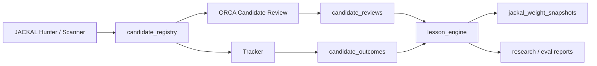

# ORCA Candidate Registry v2

이 문서는 `portfolio 중심 보조 평가`를 버리고, `JACKAL 후보 종목 학습 루프`를 중심으로 ORCA + JACKAL을 재정의하기 위한 구체 설계안이다.

목표는 단순하다.

1. JACKAL이 찾은 종목 후보를 일회성 알림으로 끝내지 않는다.
2. ORCA가 그 후보를 다음 실행에서 다시 읽고 시장 방향성과 비교한다.
3. 후보의 실제 결과를 추적해, "어떤 후보가 왜 먹혔는지"를 학습 자산으로 축적한다.

핵심 변화는 `portfolio.json`을 중심에서 내리고, `candidate_registry`를 시스템 중심 저장소로 올리는 것이다.

## 1. Why This Change

현재 구조는 두 문제가 있다.

- `portfolio.json`은 JACKAL scanner에서만 실질적으로 쓰이고, JACKAL hunter/backtest는 하드코딩된 `MY_PORTFOLIO`를 별도로 쓴다.
- ORCA의 `run_portfolio()`는 평가를 수행하지만 결과를 실제 학습 루프에 연결하지 않는다.

즉, 지금은 "보유 종목을 보조적으로 바라보는 기능"은 있지만, "후보 종목을 교육 데이터로 축적하는 구조"는 아니다.

Candidate Registry v2는 이 방향을 뒤집는다.

- `portfolio`는 선택적 UI/사용자 컨텍스트가 된다.
- `candidate_registry`는 JACKAL 후보 발굴, ORCA 정합 평가, Tracker 결과 추적, Evolution 교훈 추출의 공통 spine이 된다.

## 2. Design Goals

- 후보 종목을 `추천`이 아니라 `검증 가능한 가설`로 저장한다.
- ORCA와 JACKAL의 관계를 `시장 교사 + 종목 탐지기`로 분리한다.
- 결과는 단순 승패가 아니라 `정합/역행/실패 유형`으로 분류한다.
- 기존 SQLite spine 위에서 확장 가능해야 한다.
- 현재 `jackal_live_events`, `jackal_shadow_signals`, `predictions/outcomes`, `backtest_*`와 충돌하지 않아야 한다.

## 3. Conceptual Model



후보 1건은 "종목 이름"이 아니라 "해당 시점의 타점 가설"이다.

예시:

- `2026-04-17 10:30 KST, NVDA, swing_rebound, quality_score=73, ORCA regime=위험회피`
- 이 자체가 하나의 교육 단위다.

## 4. Candidate Lifecycle

후보는 아래 수명주기를 가진다.

1. `observed`
   - JACKAL이 후보를 발굴함
2. `reviewed`
   - ORCA가 다음 실행에서 후보를 읽고 정합성/위험 요인을 해석함
3. `tracked_partial`
   - Tracker가 1일 데이터만 확보
4. `tracked_final`
   - Tracker가 D1/D3/D5/D10 또는 swing 결과까지 확정
5. `learned`
   - Lesson Engine이 교훈과 가중치 반영까지 끝냄
6. `archived`
   - 오래된 후보를 집계 후 아카이브

## 5. Alignment Taxonomy

후보의 교육 가치는 `맞았냐`보다 `ORCA와의 관계`에서 크게 생긴다.

### 5.1 Core Labels

- `aligned`
  - ORCA 방향성과 JACKAL 후보가 같은 방향
- `opposed`
  - ORCA 방향성과 JACKAL 후보가 반대
- `neutral`
  - ORCA가 명확한 방향을 제시하지 못했거나, 후보가 특정 섹터/이벤트 특수성으로 독립적

### 5.2 Outcome Classes

- `aligned_win`
  - ORCA와 JACKAL이 모두 우호적이었고 실제로 먹힘
- `aligned_loss`
  - ORCA와 JACKAL이 정합이었지만 실패
- `opposed_win`
  - ORCA는 부정적이었지만 JACKAL 후보가 먹힘
- `opposed_loss`
  - ORCA와 JACKAL 모두 불리했고 실제로 실패
- `neutral_win`
- `neutral_loss`

`opposed_win`은 v2의 핵심 교육 자산이다.  
이 케이스는 "거시와 무관하게 강한 개별 종목 패턴"일 수 있다.

## 6. Proposed SQLite Tables

아래 테이블들은 `orca/state.py`에 추가하는 것을 전제로 한다.

### 6.1 `candidate_registry`

후보의 master row.

```sql
CREATE TABLE candidate_registry (
    candidate_id TEXT PRIMARY KEY,
    external_key TEXT NOT NULL UNIQUE,
    source_system TEXT NOT NULL,
    source_event_type TEXT NOT NULL,
    source_run_id TEXT,
    source_session_id TEXT,
    ticker TEXT NOT NULL,
    market TEXT,
    detected_at TEXT NOT NULL,
    analysis_date TEXT NOT NULL,
    candidate_status TEXT NOT NULL DEFAULT 'observed',
    signal_family TEXT,
    setup_family TEXT,
    quality_score REAL,
    quality_label TEXT,
    analyst_score REAL,
    devil_score REAL,
    final_score REAL,
    is_entry INTEGER NOT NULL DEFAULT 0,
    alerted INTEGER NOT NULL DEFAULT 0,
    payload_json TEXT NOT NULL,
    updated_at TEXT NOT NULL
);
```

설명:

- `source_event_type`
  - `hunt`, `scanner`, `shadow`, `backtest_pick`
- `setup_family`
  - `swing_rebound`, `oversold_break`, `sector_rotation`, `counter_trend` 등
- `payload_json`
  - 기존 `jackal_live_events` 또는 `jackal_shadow_signals` payload를 그대로 보존

### 6.2 `candidate_reviews`

ORCA가 후보를 다시 읽고 남긴 정합 평가.

```sql
CREATE TABLE candidate_reviews (
    review_id TEXT PRIMARY KEY,
    candidate_id TEXT NOT NULL,
    run_id TEXT,
    review_timestamp TEXT NOT NULL,
    orca_analysis_date TEXT NOT NULL,
    orca_mode TEXT,
    orca_regime TEXT,
    orca_trend_phase TEXT,
    alignment TEXT NOT NULL,
    confidence TEXT,
    review_label TEXT,
    thesis_killer_count INTEGER NOT NULL DEFAULT 0,
    thesis_killer_hit INTEGER NOT NULL DEFAULT 0,
    watch_action TEXT,
    summary_json TEXT NOT NULL,
    FOREIGN KEY(candidate_id) REFERENCES candidate_registry(candidate_id),
    FOREIGN KEY(run_id) REFERENCES runs(run_id)
);
```

설명:

- ORCA는 후보를 "추천"하지 않는다.
- ORCA는 후보를 읽고 `aligned/opposed/neutral`과 `watch_action`을 기록한다.
- `watch_action`
  - `promote`, `keep_watch`, `deprioritize`, `invalidated`

### 6.3 `candidate_outcomes`

Tracker가 채우는 객관적 결과.

```sql
CREATE TABLE candidate_outcomes (
    outcome_id TEXT PRIMARY KEY,
    candidate_id TEXT NOT NULL,
    horizon_label TEXT NOT NULL,
    measured_at TEXT NOT NULL,
    entry_price REAL,
    close_price REAL,
    peak_price REAL,
    trough_price REAL,
    return_pct REAL,
    mfe_pct REAL,
    mae_pct REAL,
    hit_threshold INTEGER,
    metrics_json TEXT,
    UNIQUE(candidate_id, horizon_label),
    FOREIGN KEY(candidate_id) REFERENCES candidate_registry(candidate_id)
);
```

권장 horizon:

- `d1`
- `d3`
- `d5`
- `d10`
- `swing`

### 6.4 `candidate_lessons`

후보 1건에서 파생된 교육 결과.

```sql
CREATE TABLE candidate_lessons (
    lesson_id TEXT PRIMARY KEY,
    candidate_id TEXT NOT NULL,
    source_review_id TEXT,
    source_outcome_id TEXT,
    lesson_type TEXT NOT NULL,
    lesson_value REAL,
    lesson_label TEXT,
    family TEXT,
    regime_bucket TEXT,
    alignment TEXT,
    summary_json TEXT NOT NULL,
    created_at TEXT NOT NULL,
    FOREIGN KEY(candidate_id) REFERENCES candidate_registry(candidate_id)
);
```

예시 `lesson_type`:

- `aligned_win`
- `aligned_loss`
- `opposed_win`
- `opposed_loss`
- `false_positive_quality`
- `missed_countertrend_strength`

## 7. Recommended Views

읽기 성능과 리포트를 위해 view를 같이 둔다.

### 7.1 `candidate_current_view`

- 각 후보의 최신 review / latest d1 / latest swing을 조인한 view

### 7.2 `candidate_alignment_stats`

- `signal_family x alignment x regime_bucket` 기준 승률

### 7.3 `candidate_countertrend_edges`

- `alignment='opposed'`인데 승률이 높은 family/top ticker 추출

## 8. Mapping from Existing Tables

기존 구조를 버리지 않고 점진 이관한다.

### 8.1 From `jackal_live_events`

현재 [orca/state.py](/C:/Users/cho.minwoo/Desktop/aria-agent-main/orca/state.py:197)의 `jackal_live_events`는 아래처럼 매핑한다.

- `event_type='hunt'` → `candidate_registry.source_event_type='hunt'`
- `payload_json.final_score` → `candidate_registry.final_score`
- `payload_json.signals_fired` → `payload_json` 내 보존

### 8.2 From `jackal_shadow_signals`

현재 [orca/state.py](/C:/Users/cho.minwoo/Desktop/aria-agent-main/orca/state.py:165)의 shadow row는 `candidate_registry`에 `source_event_type='shadow'`로 같이 넣는다.

차이는 이렇다.

- `shadow`는 저품질/미발송 후보를 보존
- `hunt`는 실제로 final pipeline을 통과한 후보를 보존

둘 다 후보라는 점에서는 동일하다.

### 8.3 From `predictions / outcomes`

ORCA의 기존 `predictions/outcomes`는 거시/시장 이벤트 예측 중심이므로 그대로 유지한다.

단, ORCA가 candidate review를 남길 때는 `candidate_reviews`로 기록하고, 필요하면 `predictions`에는 요약 이벤트만 생성한다.

추천:

- `predictions`는 시장 사건 예측
- `candidate_registry`는 종목 타점 가설

## 9. ORCA Integration

ORCA는 `portfolio` 대신 `open candidates`를 읽어야 한다.

### 9.1 New Step in `orca.main`

기존 [orca/main.py](/C:/Users/cho.minwoo/Desktop/aria-agent-main/orca/main.py:443) 이후 흐름을 아래처럼 바꾼다.

```text
Market Data
-> Verification
-> 4-Agent Report
-> Candidate Review
-> Sentiment / Rotation
-> Save Report + Candidate Reviews
```

### 9.2 Candidate Review Rules

ORCA는 후보 전체를 다 프롬프트에 넣지 않는다.

선별 기준:

- 최근 3영업일 후보
- `quality_score >= 55`
- 미해결 후보 우선
- 최대 10~15건

review 결과에 아래를 남긴다.

- `alignment`
- `review_label`
- `watch_action`
- `thesis_killer_hit`
- `summary_json`

예시:

```json
{
  "alignment": "opposed",
  "review_label": "countertrend_but_sector_supported",
  "watch_action": "keep_watch",
  "thesis_killer_hit": false,
  "reasons": [
    "ORCA는 위험회피이지만 AI 인프라 섹터 유입은 유지",
    "개별 종목 모멘텀이 거시 역풍을 일부 상쇄"
  ]
}
```

## 10. JACKAL Integration

### 10.1 Hunter

현재 [jackal/hunter.py](/C:/Users/cho.minwoo/Desktop/aria-agent-main/jackal/hunter.py:1396) 흐름에서 `top5` 결과를 `hunt_log.json`과 `jackal_live_events`에만 저장한다.

v2에서는 여기서 동시에 `candidate_registry`에 기록한다.

필수 저장 대상:

- Stage4 통과 후보
- 실제 alert 발송 여부
- macro gate 상태
- ORCA baseline regime/inflows

선택 저장 대상:

- Stage2/3 상위 후보 일부
- 이유: "발송되지는 않았지만 교육 가치 있는 near miss"를 쌓기 위해

### 10.2 Scanner

현재 [jackal/scanner.py](/C:/Users/cho.minwoo/Desktop/aria-agent-main/jackal/scanner.py:1646)와 [jackal/scanner.py](/C:/Users/cho.minwoo/Desktop/aria-agent-main/jackal/scanner.py:1754)에서 shadow와 final log를 별도로 남긴다.

v2에서는 둘 다 `candidate_registry`로 들어가야 한다.

- 품질 미달 → `source_event_type='shadow'`
- final analyzed → `source_event_type='scanner'`

### 10.3 Tracker

현재 [jackal/tracker.py](/C:/Users/cho.minwoo/Desktop/aria-agent-main/jackal/tracker.py:443) 이후 로직은 `hunt_log`를 직접 수정한다.

v2에서는:

- `candidate_registry`에서 `candidate_status in ('observed','reviewed','tracked_partial')`를 읽고
- `candidate_outcomes`를 채우며
- `candidate_status`를 `tracked_partial` 또는 `tracked_final`로 올린다

## 11. Lesson Engine Upgrade

기존 `signal_accuracy`, `ticker_accuracy`, `regime_accuracy`, `devil_accuracy`만으로는 부족하다.

v2에서는 최소 아래 축이 추가돼야 한다.

- `alignment_accuracy`
  - `aligned`, `opposed`, `neutral`
- `alignment_by_family`
  - 예: `rsi_divergence x opposed`
- `regime_alignment_matrix`
  - 예: `위험회피 x opposed_win`
- `lesson_value`
  - 단순 승패가 아니라 교육 가치

### 11.1 Educational Value Heuristic

추천 규칙:

- `opposed_win` and `quality_score >= 60` → `lesson_value = high`
- `aligned_loss` and `quality_score >= 70` → `lesson_value = high`
- `neutral_win` with low sample → `lesson_value = medium`
- 단순 `aligned_win`은 반복 표본일 경우 `medium`

이렇게 해야 시스템이 "너무 당연한 승리"보다 "진짜 배울 거리"를 더 강하게 학습한다.

## 12. Replacing `portfolio.json`

`portfolio.json`은 필수 상태에서 내려야 한다.

추천 선택지는 두 가지다.

### Option A. Remove from Core Loop

- ORCA/JACKAL 핵심 로직에서 제거
- dashboard 전용 또는 사용자 메모 전용으로만 남김

### Option B. Replace with `watch_context.json`

- 사용자가 보고 싶은 티커/섹터/금지 티커만 저장
- 예:
  - `preferred_markets`
  - `ignored_tickers`
  - `priority_sectors`
  - `manual_watchlist`

권장 방향은 `Option B`다.  
즉, 포지션 파일이 아니라 관찰/선호/제외 컨텍스트 파일로 약화시킨다.

## 13. Migration Plan

### Phase 1. Schema Add

파일:

- [orca/state.py](/C:/Users/cho.minwoo/Desktop/aria-agent-main/orca/state.py:1)

작업:

- `candidate_registry`
- `candidate_reviews`
- `candidate_outcomes`
- `candidate_lessons`
- `candidate_current_view`

### Phase 2. Write Path

파일:

- [jackal/hunter.py](/C:/Users/cho.minwoo/Desktop/aria-agent-main/jackal/hunter.py:1396)
- [jackal/scanner.py](/C:/Users/cho.minwoo/Desktop/aria-agent-main/jackal/scanner.py:1534)

작업:

- `record_candidate()` helper 호출 추가
- shadow/final/hunt를 공통 candidate row로 저장

### Phase 3. Outcome Path

파일:

- [jackal/tracker.py](/C:/Users/cho.minwoo/Desktop/aria-agent-main/jackal/tracker.py:430)

작업:

- `record_candidate_outcome()`
- `update_candidate_status()`

### Phase 4. ORCA Review Path

파일:

- [orca/main.py](/C:/Users/cho.minwoo/Desktop/aria-agent-main/orca/main.py:350)
- [orca/analysis.py](/C:/Users/cho.minwoo/Desktop/aria-agent-main/orca/analysis.py:326)

작업:

- `load_open_candidates()`
- `review_candidates_with_orca()`
- `run_portfolio()` 제거 또는 `run_watch_context()`로 대체

### Phase 5. Eval / Reports

파일:

- [orca/research_report.py](/C:/Users/cho.minwoo/Desktop/aria-agent-main/orca/research_report.py:1)
- [orca/research_gate.py](/C:/Users/cho.minwoo/Desktop/aria-agent-main/orca/research_gate.py:1)

작업:

- `aligned_win rate`
- `opposed_win rate`
- `countertrend top families`
- `worst false positives`

## 14. Immediate Implementation Order

가장 좋은 다음 구현 순서는 이렇다.

1. `orca.state`에 candidate 4테이블 추가
2. `jackal.hunter`에서 top5 후보를 `candidate_registry`에 기록
3. `jackal.tracker`가 `candidate_outcomes`를 채우게 변경
4. `orca.main`에 `candidate review step` 추가
5. `run_portfolio()`를 `run_watch_context()` 또는 `candidate review`로 대체

## 15. Expected Payoff

이 설계를 도입하면 ORCA + JACKAL은 아래 수준으로 진화한다.

- 지금:
  - 시장 분석 + 후보 알림 + 사후 추적
- v2:
  - 시장 방향성과 종목 타점의 관계를 체계적으로 축적하는 교육 시스템

결국 JACKAL은 "좋은 종목을 찾는 봇"이 아니라,
`ORCA의 거시 해석과 실제 시장 결과 사이에서 반례와 선행 신호를 학습하는 후보 탐지 엔진`
이 된다.

이게 v2의 핵심이다.
