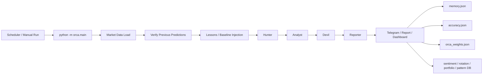
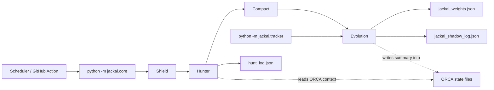
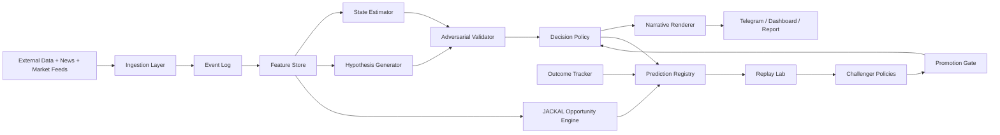

# ORCA v2 Architecture Blueprint

개선 모드 전환 선언.

이 문서는 현재 `ORCA + JACKAL` 시스템을 코드 기준으로 해부한 뒤, 장기 운영 가능한 차세대 구조로 재설계하기 위한 청사진이다. 목적은 세 가지다.

1. 현재 시스템이 어디서 강하고 어디서 무너질 수 있는지 명확히 드러낸다.
2. 분석 엔진, 학습 루프, 상태 관리, 운영 자동화를 분리해 구조적 복원력을 높인다.
3. ORCA를 "잘 돌아가는 프롬프트 파이프라인"에서 "검증 가능한 의사결정 시스템"으로 진화시킨다.

## 1. Current System Summary

현재 구조의 강점은 분명하다.

- ORCA는 `Hunter -> Analyst -> Devil -> Reporter`의 역할 분리를 통해 단일 모델 직결 구조보다 더 나은 비판적 사고 여지를 갖고 있다.
- JACKAL은 `Shield -> Hunter -> Compact -> Evolution`과 `Tracker`를 통해 발굴, 추적, 자체 보정 루프를 시도한다.
- Lessons, Pattern DB, Dynamic Weights, Sentiment, Rotation, Portfolio, Backtest가 한 프로젝트 안에 연결되어 있어 진화 지향성이 있다.

하지만 이 모든 것이 공통적으로 의존하는 것은 "프롬프트 품질"과 "공유 JSON 상태 파일"이다. 이 둘이 현재 시스템의 최대 강점이자 최대 취약점이다.

## 2. Current Workflow

### 2.1 ORCA Current Flow

### 2.2 JACKAL Current Flow

### 2.3 Current Functional Interpretation

현재 ORCA는 본질적으로 "시장 데이터 + 웹 검색 + 과거 메모리 + 휴리스틱 보정"을 한 프롬프트 흐름으로 엮어 매일 설명력 있는 리포트를 만드는 시스템이다.

현재 JACKAL은 본질적으로 "기회 탐지기 + 후행 추적기 + 약한 자기진화 엔진"이다.

문제는 두 시스템이 논리적으로는 분리되어 있지만, 운영적으로는 분리되어 있지 않다는 점이다. 둘은 동일한 저장 방식, 동일한 GitHub Actions 패턴, 동일한 파일 기반 상태 관리 철학을 공유한다. 이 때문에 한쪽의 상태 오염이나 기록 드리프트가 다른 쪽의 판단 품질로 전파될 수 있다.

## 3. Confirmed Weaknesses In Current Code

아래 항목은 실제 코드에서 확인된 구조적 취약점이다.

### 3.1 Interface Drift

- `orca.main`은 `build_baseline_context(MODE)`를 호출하지만, `orca.analysis`의 `build_baseline_context`는 `memory: list`를 기대한다.
- 이는 `MORNING` 이외 모드에서 baseline 로딩 경로가 실제 런타임 오류로 이어질 수 있음을 의미한다.
- 이 문제는 "에이전트가 잘못 판단한다" 수준이 아니라 "파이프라인 인터페이스 계약이 느슨하다"는 더 큰 구조 문제의 신호다.

### 3.2 Broken Operational Batch

- 월간 워크플로우는 `extract_monthly_lessons`를 import하지만 실제 구현은 없다.
- 이는 운영 배치가 코드 리팩터링을 따라가지 못하고 있음을 보여준다.

### 3.3 Shared Mutable JSON State

- `memory.json`, `accuracy.json`, `orca_weights.json`, `sentiment.json`, `rotation.json`, `portfolio.json`, `hunt_log.json`, `jackal_weights.json` 등 핵심 상태가 모두 직접 수정된다.
- 여러 워크플로우가 같은 상태를 갱신하고, Git 기반 커밋/리베이스로 충돌을 완화한다.
- 이 방식은 데이터 저장소가 아니라 충돌 가능한 텍스트 파일 묶음이다.

### 3.4 Silent Degradation

- 광범위한 `except Exception: pass` 패턴 때문에 데이터 누락, 파싱 실패, 학습 누락, 백테스트 예외가 시스템 장애로 표면화되지 않는다.
- 결과적으로 시스템은 "죽지 않지만 점점 멍청해지는" 방향으로 붕괴할 수 있다.

### 3.5 Reporter Bottleneck

- Hunter, Analyst, Devil이 분리되어 있어도 최종 의사결정은 Reporter가 다시 종합한다.
- 즉, 다중 에이전트처럼 보여도 사실상 하나의 최종 프롬프트 합성기가 진실 계층을 독점한다.

## 4. Structural Diagnosis

### 4.1 Structural Weaknesses

- 상태 저장과 실행 로직이 분리되지 않았다.
- 분석 시스템과 보고 시스템이 결합되어 있다.
- 연구용 상태와 운영용 상태가 분리되지 않았다.
- JACKAL의 발굴 성과가 ORCA의 평가 체계와 섞일 여지가 있다.
- Git repository가 코드 저장소이면서 동시에 운영 데이터 저장소 역할을 하고 있다.

### 4.2 Hidden Vulnerabilities

- 외부 데이터가 일부 끊겨도 fallback과 broad exception 때문에 "낮은 품질의 정상 실행"이 발생한다.
- Lessons와 Pattern DB는 강화된 서사를 더 자주 재생산할 수 있다.
- Backtest는 미래 데이터 참조를 일부 막더라도, LLM이 이미 아는 역사 지식과 서술형 note가 간접 누수 경로가 된다.
- Compact는 context overflow를 예방하지 못하고 overflow 이후 요약만 수행한다.

### 4.3 Potential Failure Modes

- 동시 실행 중 상태 파일이 덮여써져 학습 결과가 일부 유실된다.
- memory 손상 시 시스템이 빈 상태로 재시작하면서 연속성이 끊긴다.
- weights가 잘못 조정되어도 안전장치 없이 다음 날 운영 판단에 바로 반영된다.
- 외부 데이터 소스 장애가 장기간 지속되면 시스템이 fallback 점수와 서사로만 굴러가며 자기 확신을 유지할 수 있다.

### 4.4 Architectural Debt

- 파일 기반 상태 관리
- 느슨한 schema 계약
- 휴리스틱 중심 학습
- 연구/운영 경계 불명확
- GitHub Actions를 데이터 파이프라인처럼 사용하는 운영 방식

### 4.5 Intelligence & Evolution Gaps

- 현재 학습은 예측 품질을 설명 가능하게 분해하지 못한다.
- 어떤 feature가 어떤 시장 구간에서 왜 먹혔는지 추적하는 계층이 없다.
- lesson은 있지만 "검증된 policy update"는 없다.
- 진화 결과가 shadow 검증을 충분히 거치지 않고 실전 판단에 스며들 가능성이 있다.

## 5. ORCA v2 Design Principles

차세대 구조는 다음 원칙 위에서 설계해야 한다.

1. 모든 판단은 이벤트와 스냅샷으로 기록되어야 한다.
2. 운영 상태는 append-only 기록과 materialized view로 구성해야 한다.
3. 분석, 의사결정, 내러티브 생성을 분리해야 한다.
4. 연구용 실험과 실전 정책은 반드시 분리해야 한다.
5. 비용, 품질, 데이터 신뢰도는 1급 신호로 다뤄야 한다.
6. 모델은 추론 엔진이지 저장소나 상태 관리자 역할을 하면 안 된다.

## 6. Proposed ORCA v2 Architecture

### 6.1 Agent Layer Redesign

현재 4-Agent 구조는 유지할 가치가 있지만, 역할보다 계약 중심으로 재구성해야 한다.

- `Signal Ingestor`
  시장 데이터, 뉴스, 이벤트를 구조화된 evidence 단위로 적재한다.
- `State Estimator`
  현재 시장 국면, 리스크 수준, 변동성 상태, 지역별 강도 등을 추정한다.
- `Hypothesis Generator`
  가능한 방향성, 시나리오, 기회/위험 가설을 생성한다.
- `Adversarial Validator`
  각 가설의 무효화 조건, 반례, 데이터 부족, source conflict를 평가한다.
- `Decision Policy`
  실제 운영용 판단을 내린다. 이 단계는 서술이 아니라 정책 엔진이어야 한다.
- `Narrative Renderer`
  사람에게 읽히는 보고서를 만든다. 의사결정 엔진이 아니라 출력 전용 계층이다.

핵심 변화는 `Reporter`를 의사결정 계층에서 분리하는 것이다. v2에서 최종 결론은 `Decision Policy`가 담당하고, 내러티브는 그 결과를 설명만 해야 한다.

## 7. Proposed Module Boundaries

### 7.1 Core Modules

- `ingestion`
  외부 API, 웹 검색, 시장 데이터 수집
- `events`
  raw event append, dedup, source quality tagging
- `features`
  이벤트를 feature vector와 evidence bundle로 변환
- `state`
  regime, trend, volatility, liquidity state estimation
- `policy`
  운영용 판단, confidence calibration, invalidation rules
- `narrative`
  Telegram, dashboard, markdown/json report rendering
- `evaluation`
  prediction registry, outcome binding, metrics
- `research`
  backtest, replay, challenger policy testing
- `jackal_engine`
  종목 발굴, opportunity scoring, follow-up tracking

### 7.2 Shared Services

- `schema/contracts`
  모든 agent I/O schema 정의
- `storage`
  SQLite or Postgres adapter
- `observability`
  metrics, traces, failure counters, cost ledger
- `secrets`
  환경 변수 검증, runtime policy, secret scan

## 8. Data Model And Storage Strategy

v2의 핵심은 JSON 파일 묶음 대신 "이벤트 로그 + 예측 레지스트리 + materialized views" 구조다.

### 8.1 Required Tables

#### `runs`

- `run_id`
- `system` (`aria`, `jackal`, `backtest`, `tracker`)
- `mode`
- `started_at`
- `ended_at`
- `status`
- `code_version`
- `config_hash`
- `data_quality_score`
- `input_token_count`
- `output_token_count`
- `cost_usd`

#### `market_events`

- `event_id`
- `run_id`
- `source`
- `source_type`
- `headline`
- `payload_json`
- `event_time`
- `ingested_at`
- `reliability_score`
- `dedup_key`

#### `feature_snapshots`

- `snapshot_id`
- `run_id`
- `market_regime`
- `trend_phase`
- `volatility_state`
- `liquidity_state`
- `macro_state`
- `feature_json`

#### `predictions`

- `prediction_id`
- `run_id`
- `snapshot_id`
- `system`
- `subject`
- `decision_type`
- `direction`
- `confidence_raw`
- `confidence_calibrated`
- `time_horizon`
- `thesis_json`
- `invalidation_json`
- `evidence_refs`

#### `outcomes`

- `outcome_id`
- `prediction_id`
- `resolved_at`
- `label`
- `return_proxy`
- `hit`
- `score`
- `notes`

#### `lessons`

- `lesson_id`
- `source_prediction_id`
- `category`
- `regime_scope`
- `severity`
- `lesson_text`
- `evidence_json`
- `approved_for_policy`
- `created_at`

#### `policy_versions`

- `policy_version`
- `parent_version`
- `change_summary`
- `parameters_json`
- `created_at`
- `status` (`shadow`, `candidate`, `active`, `retired`)

#### `policy_evaluations`

- `evaluation_id`
- `policy_version`
- `window_start`
- `window_end`
- `metric_json`
- `promotion_recommendation`

### 8.2 Storage Rules

- raw events는 append-only
- prediction/outcome 연결은 immutable
- materialized view는 다시 계산 가능해야 함
- Git에는 코드와 정적 문서만 저장
- 운영 데이터는 DB 또는 artifact storage에 저장

## 9. Evolution Loop Redesign

현재의 lesson/weight 중심 루프는 약하다. v2에서는 아래 순서로 진화해야 한다.

### 9.1 Online Loop

1. run 수행
2. prediction 기록
3. outcome 매칭
4. calibration 및 hit-rate 측정
5. anomaly 감지

### 9.2 Offline Loop

1. 과거 prediction/outcome replay
2. 특정 regime slice에서 성능 재측정
3. challenger policy와 비교
4. 승격 기준 충족 시 candidate 생성

### 9.3 Promotion Gate

정책 승격은 아래를 모두 만족할 때만 허용한다.

- sample size minimum
- 최근 window와 장기 window 모두 개선
- Brier score 악화 없음
- 특정 regime에서 catastrophic degradation 없음
- 비용 증가 대비 성능 개선이 정당화됨

### 9.4 Lessons System Upgrade

lesson은 단순 문자열이 아니라 아래 구조를 가져야 한다.

- 어떤 prediction이 틀렸는가
- 어떤 evidence를 과대평가했는가
- 어떤 regime에서만 유효한가
- 다음 policy에 어떻게 반영되는가
- 반영은 shadow tested 되었는가

즉, lesson은 "메모"가 아니라 "정책 업데이트 후보"가 되어야 한다.

## 10. JACKAL v2 Positioning

JACKAL은 ORCA의 보조 스크립트가 아니라, 동일한 feature plane 위에 올라가는 독립 opportunity engine으로 재정의해야 한다.

### 10.1 JACKAL v2 Responsibilities

- 종목 universe 생성
- 구조화된 opportunity scoring
- 리스크 컨텍스트 반영
- alert issuance
- outcome tracking
- shadow policy evaluation

### 10.2 Separation Rules

- JACKAL accuracy는 ORCA accuracy와 분리
- JACKAL weights는 ORCA policy weights와 분리
- JACKAL이 ORCA에 제공하는 것은 "signal"과 "opportunity context"이지 "학습 결과 덮어쓰기"가 아님
- 공통 저장소는 feature store와 prediction registry뿐

## 11. Cost, Security, And Monitoring

### 11.1 Cost Control

현재 ARIA의 고정 추정 비용 방식은 운영 지표로 부족하다. v2는 실제 usage 기반 ledger가 필요하다.

- 모든 모델 호출마다 input/output token 기록
- run 단위 cost 합산
- mode/system별 월간 비용 추세 추적
- budget threshold 도달 시 auto degrade
- cheap policy, full policy, crisis policy 분리

### 11.2 Security

- `.env`만 gitignore하는 수준으로는 부족
- secret scan은 CI gate로 강제
- Telegram, Anthropic, 외부 API key는 boot-time validation 필요
- 운영 state artifact에 민감 payload 저장 금지
- report export 전에 PII/secret scrub pass 추가

### 11.3 Monitoring

필수 지표는 아래와 같다.

- data freshness
- source coverage
- parse failure rate
- fallback activation count
- missing critical field count
- token per run
- cost per run
- disagreement rate among agents
- confidence calibration drift
- outcome resolution lag

## 12. GitHub Actions Redesign

현재 워크플로우는 "실행 후 파일 커밋" 패턴에 과도하게 의존한다. v2에서는 아래 구조로 재편해야 한다.

### 12.1 Current Problems

- 상태 충돌을 Git rebase로 처리
- 연구 결과와 운영 상태가 main branch에 뒤섞임
- 배치 실패와 데이터 품질 저하가 분리되지 않음

### 12.2 Proposed Workflow Split

#### `aria-run.yml`

- daily production analysis
- DB write only
- no auto-commit of mutable state
- artifact upload for report outputs

#### `jackal-run.yml`

- opportunity scan
- alert generation
- hunt_log를 DB에 저장

#### `outcome-resolver.yml`

- prediction/outcome binding
- delayed resolution
- no policy mutation

#### `policy-eval.yml`

- replay/backtest
- challenger evaluation
- promotion recommendation only

#### `policy-promote.yml`

- manual approval or guarded auto-promotion
- active policy version switch

### 12.3 Concurrency Rules

- workflow `concurrency group` 사용
- same system + same mode 동시 실행 금지
- policy mutation job은 단일 실행만 허용
- production run과 backtest run은 저장소 레벨에서 분리

## 13. Migration Roadmap

### Phase 0: Immediate Stabilization

기간: 1주

- interface mismatch 수정
- missing batch import 수정
- broad exception에 최소한의 structured logging 추가
- 핵심 상태 파일 write에 atomic save 적용
- workflow concurrency group 추가

### Phase 1: State Separation

기간: 2주

- `runs`, `predictions`, `outcomes`용 SQLite 도입
- `memory.json`, `accuracy.json`, `hunt_log.json` 일부를 DB로 이관
- report 출력은 artifact 또는 reports 디렉터리 유지

### Phase 2: Agent Contract Hardening

기간: 2~3주

- 각 agent 출력 schema 고정
- evidence, confidence, invalidation, source quality 필드 의무화
- Reporter를 narrative renderer로 축소

### Phase 3: Evaluation And Replay Lab

기간: 3주

- prediction registry 본격 운영
- calibration metrics, regime-sliced evaluation 도입
- challenger policy shadow 테스트 시작

### Phase 4: Full ORCA v2 Promotion

기간: 4주+

- Git 기반 mutable state 제거
- JACKAL/ORCA 공통 feature plane 구축
- policy promotion gate 운영
- dashboard를 observability 중심으로 재구성

## 14. Immediate Action List

바로 손대야 하는 항목은 아래 다섯 가지다.

1. baseline context 인터페이스 버그 수정
2. monthly workflow import 오류 수정
3. mutable state write에 atomic write와 lock 도입
4. 운영용 accuracy와 JACKAL shadow accuracy 분리
5. GitHub Actions auto-commit 기반 상태 관리 축소

## 15. Final Position

현재 ORCA + JACKAL은 "아이디어 검증"을 넘어선 시스템이다. 하지만 아직 "운영형 지능 시스템"은 아니다.

현재 구조는 다음 질문에 약하다.

- 이 판단은 어떤 증거 묶음에서 나왔는가
- 이 confidence는 calibration 되었는가
- 이 lesson은 실제로 정책을 개선했는가
- 이 진화는 실전 승격 전 shadow 검증을 통과했는가
- 이 상태 파일은 마지막으로 누가, 왜, 어떤 컨텍스트에서 바꿨는가

ORCA v2의 목표는 더 똑똑한 문장을 만드는 것이 아니다. 더 검증 가능하고, 더 복원력 있고, 더 설명 가능한 의사결정 시스템으로 바꾸는 것이다.

그 전환의 핵심은 세 가지다.

1. prompt 중심 사고에서 contract 중심 사고로 이동
2. file 중심 상태 관리에서 event 중심 상태 관리로 이동
3. lesson 중심 학습에서 prediction registry 중심 학습으로 이동
